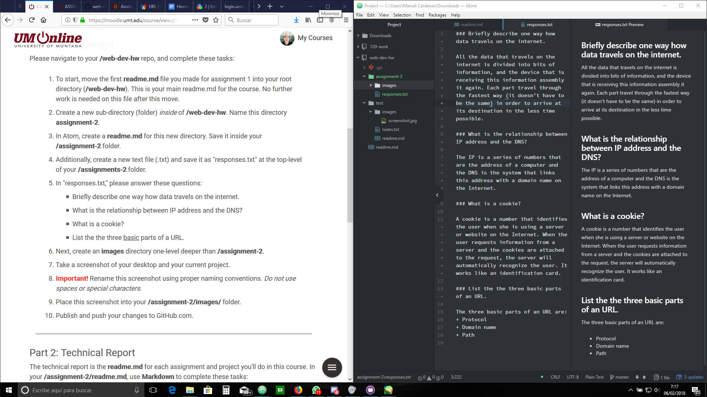

## Assignment 2

A Version Control System is a software that saves the changes to a file. We use this system because it is easier to get track of the history of a file and, if one of the steps doesn’t work, it is possible to return to the previous one. It also makes easier the collaboration between several users.

[This is my responses file](./responses.txt)

During this week I learned more about the Internet, the Infrastructure, the protocols and the Web Addresses. I also read abut the parts of the URLs and the meaning of them.
I created my second repository on GitHub and I used the desktop application to push all the changes I did. Additionally, I experimented changing different files and checked the consequences of it.

