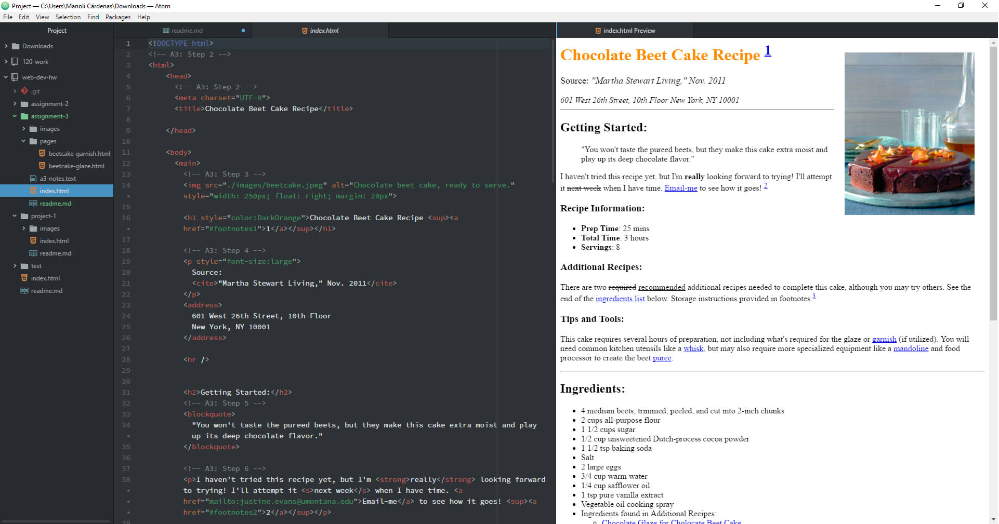

## Asignment 3

+ A page can only have one <head> element and one <body> element.
    + The <head> element contains processing information and document data. The site visitors can't see the information inside this element. <title> is only required element.
    + The <body> contains all the visible data.

+ The structural markup organizes the site's information and guides the visitor. Meanwhile, the semantic markup reinforces the meaning of the information displayed. Screen readers or search engines can use this extra information.

+ During this week I followed this steps:
 1. I read all the website's information.
 2. I accomplished all the ToDo tasks.
 3. I read about the different elements and their importance.
 4. I tried different tags like <u> and attributes.
 5. I learned how to create lists, external and internal hyperlinks and I practiced it.
 3. I downloaded the assignment material.
 4. I followed all the instructions to commit the assignment.
 5. I checked all the details of the code.
 6. I checked the code was correct and pushed it to my repo.

+ During this week I didn't have any problem. I think that the rules to write proper code were really interesting and I decided to search more about them.

