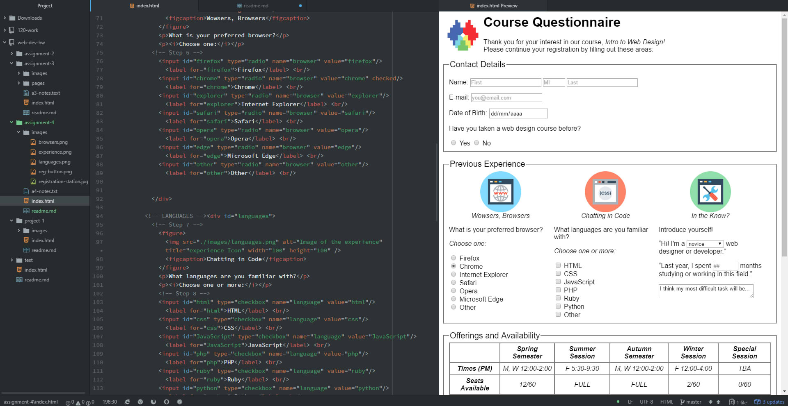

## Asignment 4

+ Alt text (alternative text) is a detailed description of the image that accompanies. This attribute is used by screen readers for those who are visually impaired.

+ I have used all the form types that I have read about this week. The most famous form is the plain text and the password one; they are used n order to login into websites the majority of the times. Additionally, the text area is used to leave comments on a website and the checkbox input is used to confirm the subscription to newsletters or to agree to terms and conditions.

+ During this week I followed this steps:
 1. I read all the website's information.
 2. I accomplished all the ToDo tasks.
 3. I read about the different elements and their importance.
 4. I learned how to optimize an image and how to use the ´´ element.
 5. I learned how to create a table and the different its different elements.
 6. I read how to create a form and I learned about the different uses of each type.
 7. I practiced how to create forms and use correctly their elements.
 8. I learned about the form management and the HTML5 inclusions
 3. I downloaded the assignment material.
 4. I followed all the instructions to commit the assignment.
 5. I checked all the details of the code.
 6. I checked the code was correct and pushed it to my repo.

+ During this week I didn't have any problem. I think that the different types of forms were really interesting and I decided to search more about them.

