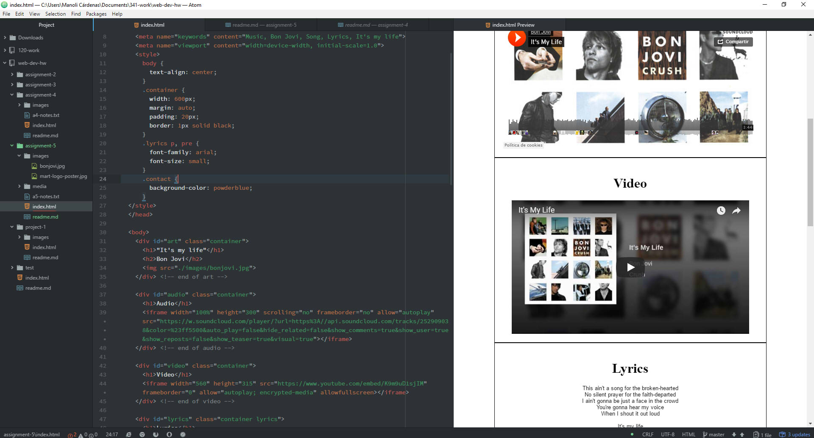

## Asignment 5

+ The `
` element is used to create a block based structure and organize the content of a website.
+ The `<class>` attribute is used to identify and classify different HTML elements. Unlike the `<id>` element, the `<class>` attribute doesn't need to be unique and one element can have several `<class>` values.
+ The `<id>` element is used to identify a HTML element.
+ The `` is the inline version of the `
` element.

+ The third-party hosting allows you to display a high-quality media and reduces the chance of incompatibility. Additionally, you will use less bandwidth and, as a result, the hosting will be cheaper.

+ During this week I followed this steps:
 1. I read all the website's information.
 2. I accomplished all the ToDo tasks.
 3. I read about the different elements and their importance.
 4. I learned about the `<id>`, `
` and the `` elements and the `<class>` attribute.
 5. I learned how to use the `<iframe>` and the `<meta>` element.
 6. I read how to solve conflicts with the escape characters.
 7. I learned how to use manage the media and the importance of third-party hosting.
 3. I downloaded the assignment material.
 4. I followed all the instructions to commit the assignment.
 5. I checked all the details of the code.
 6. I checked the code was correct and pushed it to my repo.

+ During this week I didn't have any problem. I think that the the importance of third-party hosting was really interesting and I decided to search more about it.

