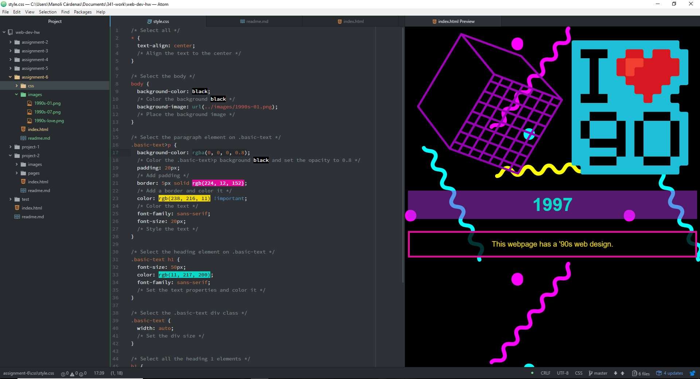

## Assignment 6

+ For this assignment I choose the 90s and the 1990s-1, 1990s-7 and 1990s-love graphics. In order to design my webpage, I searched original 90s websites and learned about their main characteristics like; repeated background images, bright colors, black backgrounds and the number of images placed.

+ I choose my color palette because it matches with the graphics used and with the 90s general web design palette. These are the colors:
  + rgb(224, 12, 152)
  + rgb(238, 216, 11)
  + rgb(11, 217, 200)
  + rgb(170, 51, 218)
  + rgb(0, 0, 0)

+ During this week I followed this steps:
 1. I read all the website's information.
 2. I accomplished all the ToDo tasks.
 3. I read about the different components and rules and their importance.
 4. I learned how to write comments on CSS and how to link the CSS document to the HTML.
 5. I learned about the selector types and the chaining selectors.
 6. I read about the cascading and the inheritance and I learned how to use them.
 7. I learned the importance of color and how to use it on CSS.
 4. I followed all the instructions to commit the assignment.
 5. I checked all the details of the code.
 6. I checked the code was correct and pushed it to my repo.

