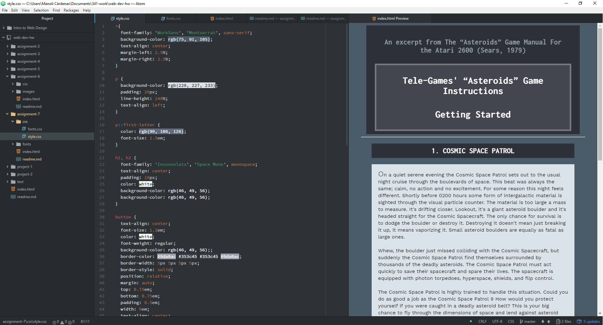

## Assignment 7

+ For this assignment I choose the Atari text and the Work Sans (Sans serif) and Inconlosata (monospace) fonts for the website. Additionally, I choose as fallback the Montserrat and Space Mono fonts. I wanted to have a monospace and Sans Serif fonts to preserve a bit of the videogame aesthetic.

+ The System Fonts are already installed on the local device or system while the Web Fonts are hosted on the server. The Web-safe Fonts are those that are always available. The importance of having a fallback is that if the main font is not available there's a second font that is similar and can be used instead.

+ During this week I followed this steps:
 1. I read all the website's information.
 2. I accomplished all the ToDo tasks.
 3. I read about the different components and rules and their importance.
 4. I learned the importance of the fonts and how they can change the overall image of a website.
 5. I learned about the importance of the fallbacks fonts.
 6. I read about the Properties of the fonts and how to use them.
 7. I learned about the leading, the kerning, the tracking and the word spacing.
 8. I read about the Pseudos and how to use them.
 9. I learned how the different ways to source a font and how to use the @fon-face selector.
 4. I followed all the instructions to commit the assignment.
 5. I checked all the details of the code.
 6. I checked the code was correct and pushed it to my repo.

