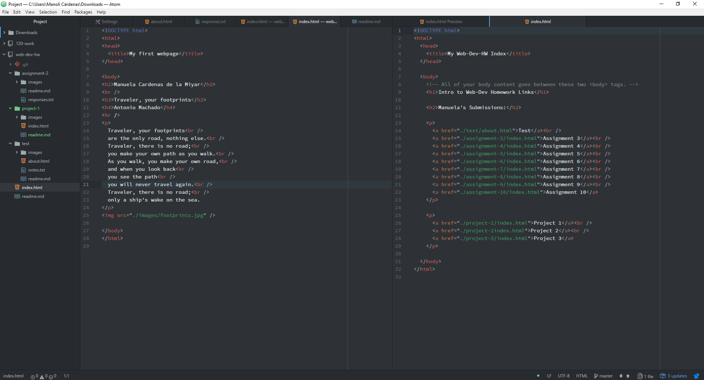

## Project 1
---

+ My favourite browsers are Chrome and Firefox. The browser renders all the code that the server sends when a web page is requested and displays all the content of the website.

+ I started searching the New York Times webpage, Youtube, Tumblr and Google. I explored how these website were when they were released and how many changes they had until now. YouTube's design has changed meaningfully and all the graphic components were essential to the website's development.

+ During this week I followed this steps:
  1. I learned about the browsers and how they work.
  2. I started to read about HTML's story and development and I learned the different components and the hierarchy of them.
  3. I compared markdown with HTML in order to learn all the differences.
  4. I created my first HTML file and pushed it to GitHub.
  5. I learned the importance of index.html and I created one.
  6. I read about the Domain Name, Nameservers and Servers.
  7. I made my repo a webpage with GitHub page.
  8. I created project-1 and I wrote the index.html.
  9. On my project-1 I decided to cite an Antonio Machado's poem. Additionally I chose to write it using ´´
´´ and separate the lines with breaks ´´ ´´.

+ I didn't have any problem this week. I found really interesting the introduction to HTML and the importance of the index.html. I showed to one of my classmates how to know the size of an image.

