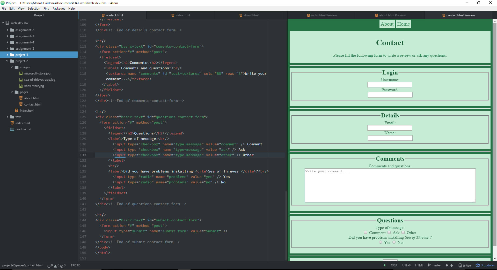

## Project 2

+ I enjoyed learning HTML, I found it really interesting and I'm used now to the type of structure that it follows. In the beginning, I got a bit lost when I was double checking the code and searching for errors, but at this point, I found it really easy to read and to detect any errors. Probably, the most difficult part for me was the `` element because I had a lot of errors when I wrote them and also because it was at the beginning, although, now I don't have any problems with it.

+ I think that learning CSS will be very interesting and it will add a lot of possibilities to my future projects.

+ During this week I followed this steps:
 1. I read all the website's information.
 2. I accomplished all the ToDo tasks.
 3. I read about the different elements and their importance.
 4. I learned about the `<style>` and the `<nav>` elements.
 5. I reviewed all the past lessons.
 4. I followed all the instructions to commit the assignment.
 5. I checked all the details of the code.
 6. I checked the code was correct and pushed it to my repo.

